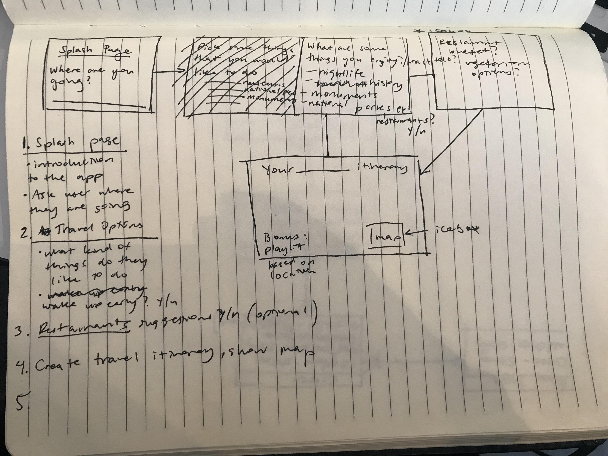
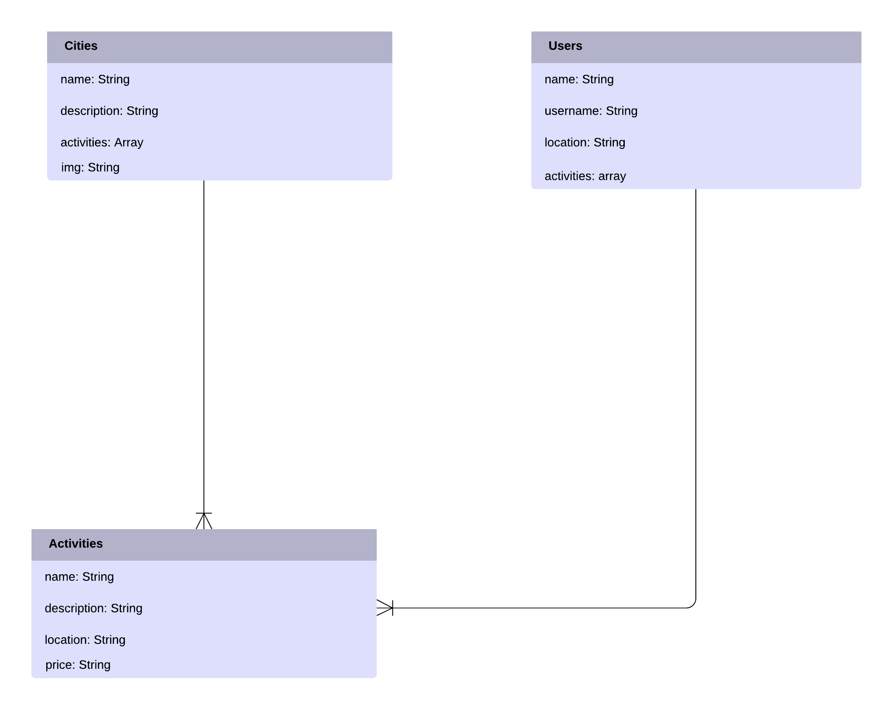

# Itinerator

## Overview
For Project 2 I created a travel assistance application that allows users to quickly navigate to a city, view a list of recommended activities for that city, and use it to create an informed itinerary for themselves. I also added a Users page for users to create a profile and suggest activities themselves, as well as display their favorite activities.

## Technologies Used
HTML5, Javascript, MongoDB, Mongoose, Express, Handlebars, Node.js

## Features
* Navigate to a city page, view a list of recommended activities for that city
* View list of users, view user pages with user information regarding the cities they're from and their recommended/favorite activities
* Suggest your own cities, suggest your own activities

## Problems I Ran Into
Like my last project, my original idea was much bigger in conception than was actually possible with my allotted timeframe and my current skillset. My original idea was to have users navigate to a splash page, type in a city of their choice, select custom preferences regarding the types of places they want to visit (are they into nightlife, are they into historical sites, , do they want to include restaurants/hotels/ their price range, etc.) and have the application return a customized itinerary without the user needing to do any work. I then simplified the idea to its current state after realizing I would not be able to include all my intended features on time.

Throughout my project, I ran into issues that I would not have been able to solve on my own without the help of the instructional assistants as well as the lead instructor, and other classmates who ran into the same issues and were able to solve them. I feel as though these errors are so specific that it is difficult to simply google and find a quick fix, so many times I had to rely on my (limited) knowledge of backend and sleuth through the files and fix the errors through trial and error. I definitely think that further experience with backend development will greatly improve my debugging skills. 

## Wireframe

## ERD

## Future Development
In the future I would like to add the features I originally intended to have, as well as add authentication to the Users page.

## Links

#### Trello
https://trello.com/b/naGm7WJO/project-2-itinerator

#### Heroku Live Site
https://morning-depths-99514.herokuapp.com/
